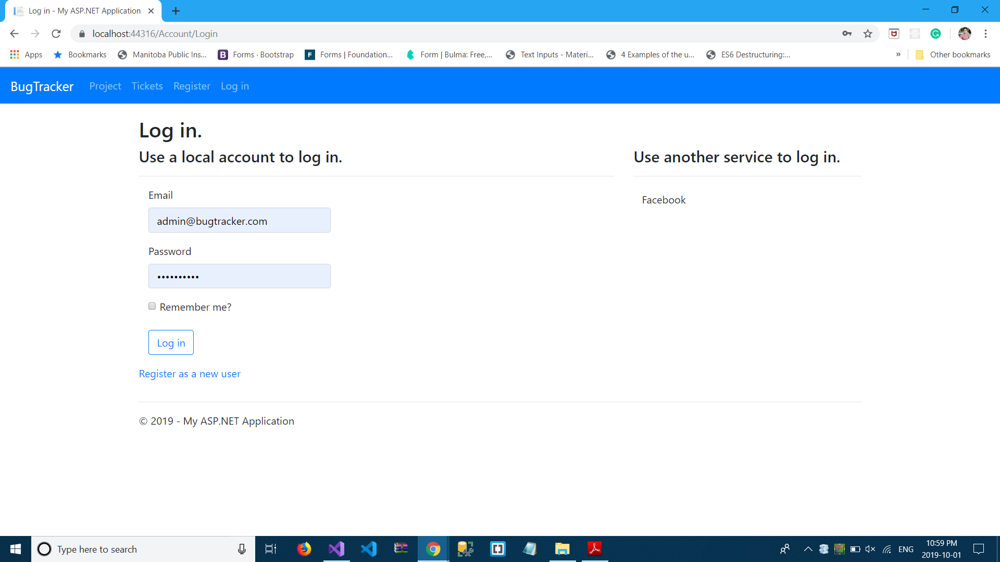
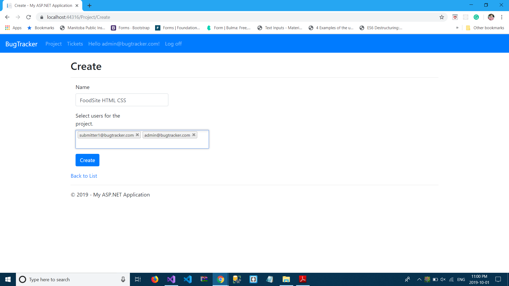

# Bug-Tracker
## Technologies used
1. Asp.net MVC
2. C#
3. Bootstrap
4. JQuery
5. Choosen.js
6. Data-Tables
## Features
1. Developed whole project as per SRS document attached in repo.
## Screen Shots
1. Login

  

2. Register

  
  
3. Create project

  
  
4. Create Ticket

  
  
5. ListTickets

  
  
6. Update Ticket Status

  
  
7. Ticket Comment

  
  
8. Comment List

  
  
9. Attachment List

  
